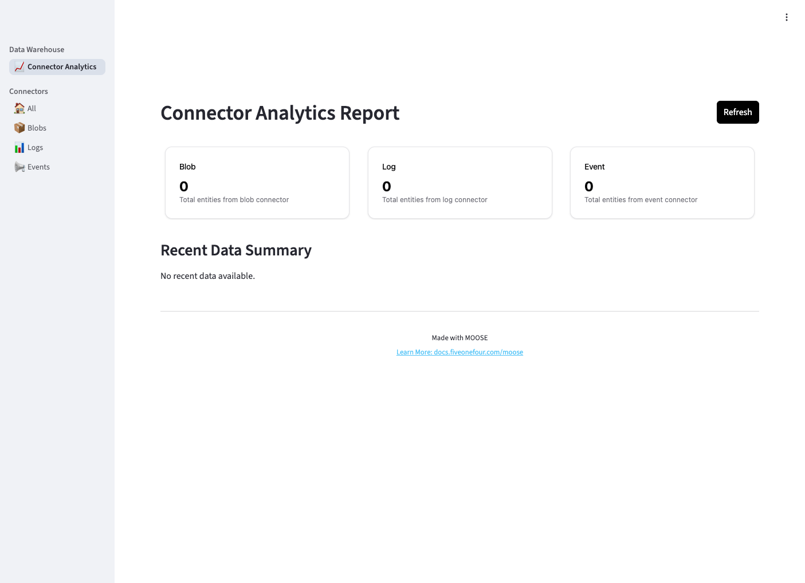
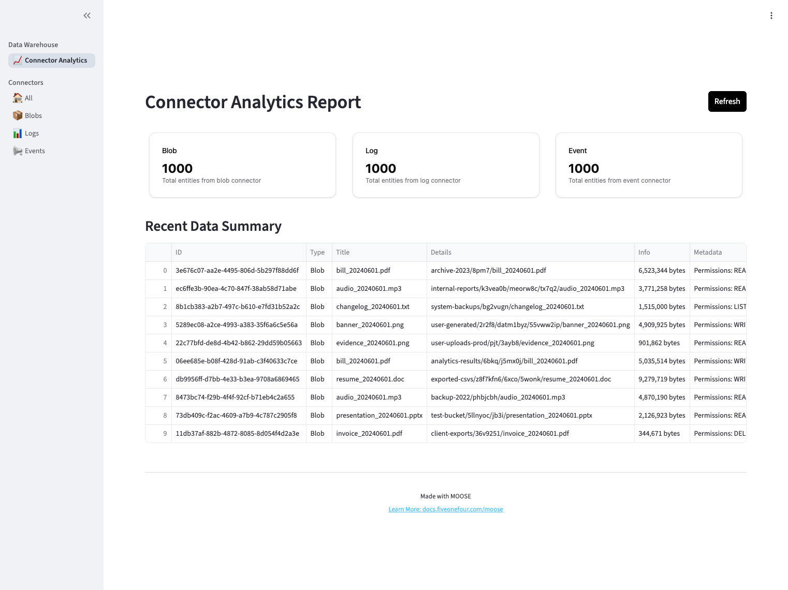
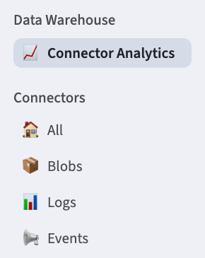
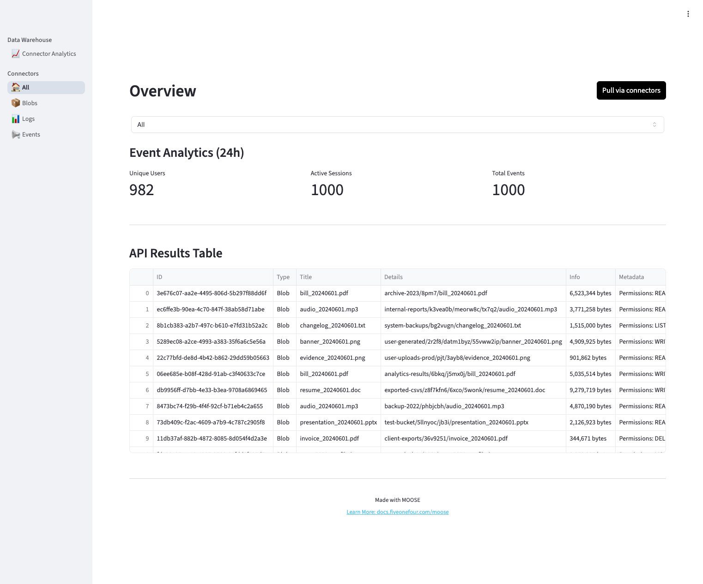
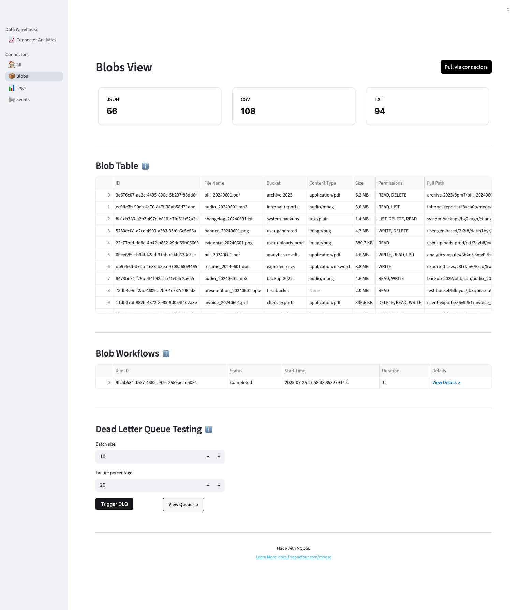
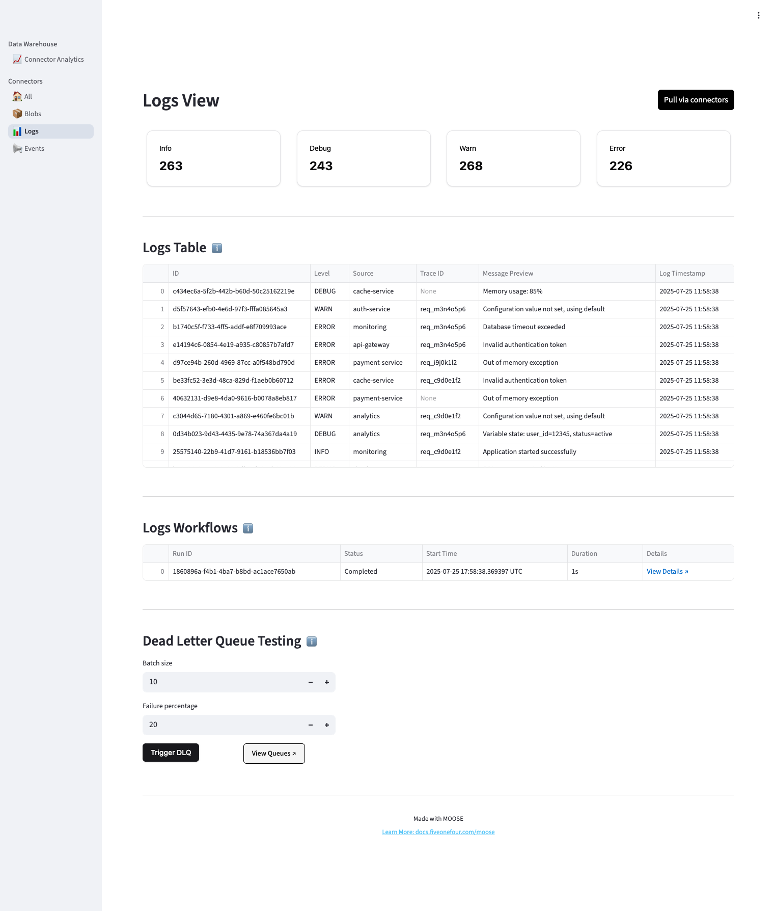
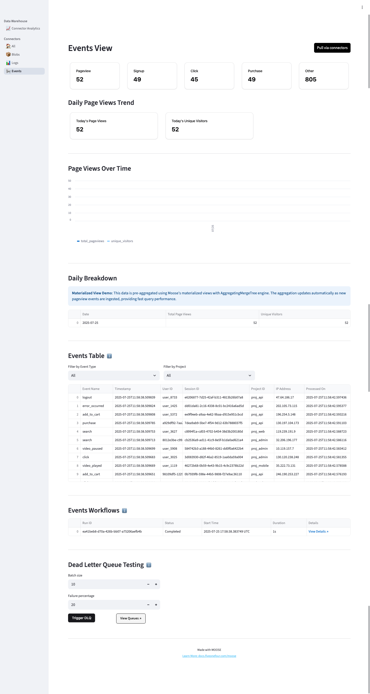

# Walk-Through Tour

## Overview

The Data Warehouse Frontend is a Streamlit-based web application that provides business users and data analysts with an intuitive interface to interact with the Moose-powered analytical backend. It transforms complex data warehouse operations into simple, visual interactions that require no technical expertise. 

The application enables self-service analytics, real-time data exploration, operational visibility into data pipeline health, and decision-making support through automated data extraction and visualization. 

Key features include one-click data extraction from multiple sources (blob storage, application logs, user events), automated data processing with real-time status updates, centralized data management through a unified interface, and interactive dashboards for business insights.

> For a detailed overview of the frontend application's architecture and business value, see: [Data Warehouse Frontend Application Overview](./web-front-end.md)

In this walkthrough document, we'll step through each frontend page. Keep in mind that all pages are implemented using the following Moose framework features:

- **Data Models**: Pydantic `BaseModel` classes with `Key[str]` primary keys and proper type annotations
- **IngestPipeline**: Six pipelines (source + final) with ingest, stream, table, and DLQ configurations  
- **Stream Transformations**: Real-time data processing with `.add_transform()` and timestamp addition
- **ConsumptionApi**: Type-safe HTTP endpoints using ClickHouse native parameter binding
- **Workflow**: Temporal-powered workflows for pull-based data extraction with failure simulation
- **Dead Letter Queue**: Automatic error handling with DLQ recovery transforms

## Landing page

When the Data Warehouse web front-end launches, users see the Connector Analytics page displaying three data sources: Blob, Log, and Event. Initially empty, clicking "Refresh" triggers Moose workflows that extract data via connectors, process it through real-time streams with transformations, and store it in ClickHouse tables. The page then displays unified metrics and recent data from all three sources.

When you first launch the front-end you won't see any data.  however, after pressing the "Refresh" button a request is sent to the Data Warehouse backend which uses the data connectors to fetch data.

The Connector Analytics Report provides a unified dashboard view of all data sources. Three metric cards display real-time counts for Blob, Log, and Event connectors. The "Recent Data Summary" table shows the latest 10 records across all sources with key details like file names, sizes, and permissions for blobs. Users can trigger fresh data extraction by clicking the "Refresh" button, which populates the dashboard with current metrics and recent data from the warehouse.

## Front-end navigation

During this tour we'll step through the front-end pages using the navigation panel shown on the left of the screen.

Under the "Connectors" section we have links for All, Blobs, Logs and Events.  All shows overview data for all of the connections and individual connector pages show specific information for a connector.

## Connectors

### All page
Connectors are mock data generators that simulate real-world data sources (blob storage, application logs, user events) for the data warehouse. They use a factory pattern to create domain-specific extractors that generate structured test data. In the data warehouse, Moose workflows use these connectors to extract data, which then flows through ingest pipelines for real-time processing and storage. Each connector produces Pydantic models that match the source data schemas, enabling type-safe data flow from extraction through transformation to final storage.

The `All` connectors page displays a unified dashboard showing combined data from all three connectors. It features metric cards displaying real-time counts for Blob, Log, and Event data sources, plus a "Recent Data Summary" table showing the latest 10 records across all sources. Users can trigger fresh data extraction for all connectors simultaneously using the "Refresh" button, which populates the dashboard with current metrics and recent data from the warehouse.

The top filter dropdown allows users to filter the view by specific connector types: "All", "Blob", "Logs", or "Events". When "Events" is selected, additional event analytics metrics are displayed showing unique users, active sessions, and total events over the past 24 hours. The filter dynamically updates the data table to show only records from the selected connector type.

### Blobs page

The Blobs page provides a detailed view of blob storage data with four main sections:

1. **Summary Cards**: Three metric cards display counts by file type (JSON, CSV, TXT) extracted from blob file names. The "Pull via connectors" button triggers the blob workflow to extract fresh data from the blob connector.

2. **Blob Table**: A comprehensive table showing individual blob records with columns for ID, File Name, Bucket, Content Type, Size (formatted in human-readable bytes/KB/MB), Permissions (formatted as comma-separated list), and Full Path (constructed from bucket, path, and filename). The table displays various file types including PDFs, MP3s, TXT files, PNGs, and DOCs with their associated metadata.

3. **Blob Workflows**: Shows recent workflow execution history for blob processing, including Run ID, Status (Completed/Failed), Start Time, Duration, and clickable "View Details" links that open the Temporal UI for detailed workflow inspection.

4. **Dead Letter Queue Testing**: Interactive controls for testing the DLQ system with configurable batch size and failure percentage inputs. The "Trigger DLQ" button simulates failures during blob processing, while "View Queues" opens the Redpanda UI. When DLQ messages are retrieved, they display in a filtered table showing partition, offset, error details, and record information. Users can select individual messages to view their complete JSON payload for debugging and recovery analysis.

We'll revist the DLQ testing section later in this walkthrough as it's common to all connector pages.

**Behind the Scenes**: The Summary Cards pull data through Moose's ConsumptionApi, which automatically queries the underlying ClickHouse tables. The Blob Table gets its data from the OlapTable via ConsumptionApi with built-in SQL injection protection through parameter binding. The Blob Workflows section taps into MooseClient.workflows to show real-time Temporal execution history. And the Dead Letter Queue Testing leverages Moose's DLQ transforms and recovery mechanisms, using DeadLetterModel to handle failed records and enable message recovery.

### Logs page

The Logs page provides a detailed view of application log data with four main sections:

1. **Summary Cards**: Four metric cards display counts by log level (INFO, DEBUG, WARN, ERROR) extracted from log entries. The "Pull via connectors" button triggers the logs workflow to extract fresh data from the logs connector.

2. **Logs Table**: A comprehensive table showing individual log records with columns for ID, Level, Source, Trace ID, Message Preview (truncated for readability), and Log Timestamp (formatted for better display). The table displays various log levels and sources with their associated metadata.

3. **Logs Workflows**: Shows recent workflow execution history for logs processing, including Run ID, Status (Completed/Failed), Start Time, Duration, and clickable "View Details" links that open the Temporal UI for detailed workflow inspection.

4. **Dead Letter Queue Testing**: Interactive controls for testing the DLQ system with configurable batch size and failure percentage inputs. The "Trigger DLQ" button simulates failures during logs processing, while "View Queues" opens the Redpanda UI. When DLQ messages are retrieved, they display in a filtered table showing partition, offset, error details, and record information. Users can select individual messages to view their complete JSON payload for debugging and recovery analysis.

**Behind the Scenes**: The Summary Cards pull data through Moose's ConsumptionApi, which automatically queries the underlying ClickHouse tables. The Logs Table gets its data from the OlapTable via ConsumptionApi with built-in SQL injection protection through parameter binding. The Logs Workflows section taps into MooseClient.workflows to show real-time Temporal execution history. And the Dead Letter Queue Testing leverages Moose's DLQ transforms and recovery mechanisms, using DeadLetterModel to handle failed records and enable message recovery.

### Events page

The Events page provides a comprehensive view of user event data with five main sections:

1. **Summary Cards**: Five metric cards display counts by event type (Pageview, Signup, Click, Purchase, Other) calculated from event analytics. The "Pull via connectors" button triggers the events workflow to extract fresh data from the events connector.

2. **Daily Page Views Trend**: A materialized view section showing aggregated page view data with three metric cards (Today's Page Views, Today's Unique Visitors, Change from Yesterday), a line chart displaying page views over time, and a daily breakdown table. This demonstrates Moose's materialized view capabilities with AggregatingMergeTree engine.

3. **Events Table**: A comprehensive table showing individual event records with filtering controls for Event Type and Project. The table displays columns for Event Name, Timestamp, User ID, Session ID, Project ID, IP Address, and Processed On timestamp.

4. **Events Workflows**: Shows recent workflow execution history for events processing, including Run ID, Status (Completed/Failed), Start Time, Duration, and clickable "View Details" links that open the Temporal UI for detailed workflow inspection.

5. **Dead Letter Queue Testing**: Interactive controls for testing the DLQ system with configurable batch size and failure percentage inputs. The "Trigger DLQ" button simulates failures during events processing, while "View Queues" opens the Redpanda UI. When DLQ messages are retrieved, they display in a filtered table showing partition, offset, error details, and record information. Users can select individual messages to view their complete JSON payload for debugging and recovery analysis.

**Behind the Scenes**: The Summary Cards pull data through Moose's ConsumptionApi with event analytics calculations. The Daily Page Views Trend uses MaterializedView with AggregatingMergeTree engine for pre-aggregated data. The Events Table gets its data from the OlapTable via ConsumptionApi with filtering capabilities. The Events Workflows section taps into MooseClient.workflows to show real-time Temporal execution history. And the Dead Letter Queue Testing leverages Moose's DLQ transforms and recovery mechanisms, using DeadLetterModel to handle failed records and enable message recovery.

### Dead Letter Queue Testing

